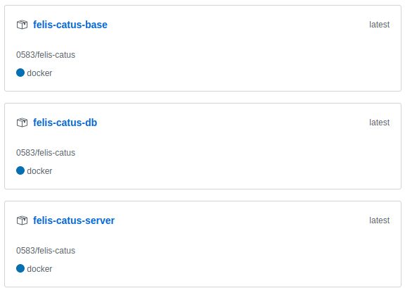
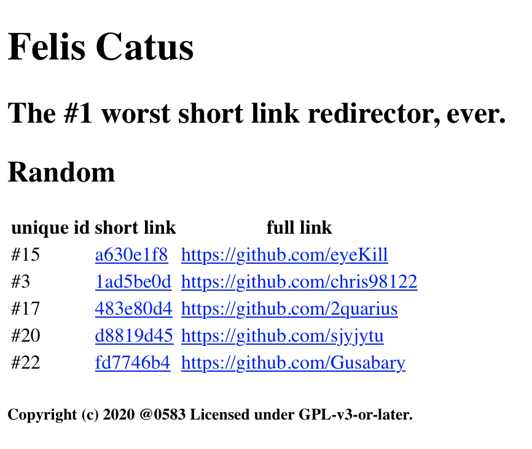

# felis-catus

### Group member & Division

* 于喜千  CI/CD, Tiny Application, PostgreSQL, Docker compose, all docker image
* 袁卓    remote server, Kubernetes, Sheduler
* 王邵宇  Kubernetes, Sheduler
* 马包威  db数据库数据
* 周雪振  sql, markdown

### Implement
* Implement local-usable short-link redirector
* split the system into server image and `PostgreSQL` image
* deploy system on single server with `Docker Compose`
* deploy system on server clusters and implement scheduler
* implement database synchronizing and caching policies based on `kong`
* write final report

---

##  Prepare a CI/CD environment


&emsp;&emsp;We build CI/CD environment for our short-link redirector project using two .yaml file(`azure-pipelines.yml` for CI, `.github/workflows/dockerimage.yml` for CD) which contain following configurations. 
* CI
```
# Python package
# Create and test a Python package on multiple Python versions.
# Add steps that analyze code, save the dist with the build record, publish to a PyPI-compatible index, and more:
# https://docs.microsoft.com/azure/devops/pipelines/languages/python

trigger:
- master

pool:
  vmImage: 'ubuntu-latest'
strategy:
  matrix:
    Python37:
      python.version: '3.7'

steps:
- task: UsePythonVersion@0
  inputs:
    versionSpec: '$(python.version)'
  displayName: 'Use Python $(python.version)'
- script: |
        sudo apt-get update &&
        sudo apt-get -y install postgresql libpq-dev &&
        echo "host    all             all             127.0.0.1/32            md5" > sudo tee -a /etc/postgresql/9.5/main/pg_hba.conf &&
        sudo service postgresql restart && sleep 3 &&
        sudo -u postgres psql -c "ALTER USER postgres PASSWORD 'postgres';" &&
        sudo service postgresql restart && sleep 3
  displayName: 'Install postgresql'

- script: |
    python -m pip install --upgrade pip
    pip install -r requirements.txt
  displayName: 'Install dependencies'

- script: |
    cd ./src
    ./init_db.sh < '\n'
    ./init_link.sh < '\n'
    python ./gen_rb.py
    ./init_data.sh
  displayName: 'Prepare PostgreSQL'
```

* CD
```
name: Docker Image Build

on: [push]
jobs:
  build:
    runs-on: ubuntu-latest
    steps:
    - uses: actions/checkout@v1
    - name: Build the Docker image
      env:
        ACCESS_TOKEN: ${{ secrets.ACCESS_TOKEN }}
        DOCKERHUB_TOKEN: ${{ secrets.DOCKERHUB_TOKEN }}
      run: | 
        cd docker
        ./build_base_docker_github.sh
        ./build_docker_github.sh
        ./build_base_docker_dockerhub.sh
        ./build_docker_dockerhub.sh
```

&emsp;&emsp;We provide demo with 3 packages on github. And they will `build images automatically and keep updating`.



## Tinyurl application

* Front-end



&emsp;&emsp;Our Front-end is implemented using files in `src/templates/`, it is just a simple page! And, it show 2 messages: current system status and 5 short links got from back-end. To use short-link, input url on browse. e.g., 
```
// length of <num> is 8
http://<ip>:<port>/t/<num>
```
&emsp;&emsp;[./src/templates/main_empty.tpl](./src/templates/main_empty.tpl)

&emsp;&emsp;[./src/templates/main.tpl](./src/templates/main.tpl)

* Back-end

&emsp;&emsp;Our back-end is implemented using file [./src/main.py](./src/main.py). Our back-end has three simple functions: it implement short-link, provide current system status, and provide 5 short links at random.

* Database

&emsp;&emsp;We use `PostgreSQL` store our data. There is only one table in the database. All information can be got in `docker/db/`. We have a independent image for db. 

&emsp;&emsp;[./docker/db/initi.sql](./docker/db/initi.sql)

&emsp;&emsp;[./docker/db/Dockerfile](./docker/db/Dockerfile)

## Prepare a Kubernetes environment & Make application distributed

* Remote Serve

&emsp;&emsp;We use remote server on `awseducate`.

* Cluster

&emsp;&emsp;K8S环境的搭建：

&emsp;&emsp;[./cluster](https://github.com/0583/felis-catus/tree/cluster/cluster)

&emsp;&emsp;Schedule & Load balance

&emsp;&emsp;[./schedule](https://github.com/0583/felis-catus/tree/cluster/scheduler)

&emsp;&emsp;所有Pod节点的配置

&emsp;&emsp;[./shcedule/yamls/](https://github.com/0583/felis-catus/tree/cluster/scheduler/yamls)